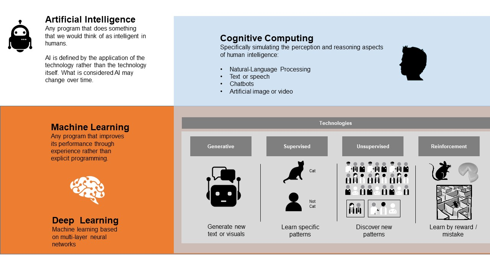

# Artificial Intelligence

## Artificial Intelligence

*Artificial Intelligence* describes any system that behaves like we expect human beings to do. If you talk to an AI system, or ask it a question, it will respond like a real human.

Call a system AI is a matter of how it behaves. Behind the scenes, it is build by a number of technologies, selected and trained for the specific application.

The technologies behind AI systems are developing at a fast pace, both the internal power of algorithms and training data, as well as machine-human interfaces.

### Artificial General Intelligence

AGI is a selv-consious system with it's own desires, consience, reasoning and decisions. AGI will be selv-aware and may have desires to stay alive, multiply and evolve - characteristics of life itself.

It may be mimicking humans or animals, or it may be a totally difference kind of being.

As of today, we do not have any true AGI beings. The opinions of when that may happen range from never to the near future. Most agree, however, that if an AGI is ever born, it will have paramount implicaions for life on earth.

## Machine Learning

### Deep Learning

## Cognitive Computing

## Technologies

There are a number of technologies and algoritms available for building AI systems. They have different attributes and are selected according to the target use case.

### Supervised

### Unsupervised

### Reinforcement

### Generative

## Development

Building AI systems has historically required highly specialized IT developers and 'data scientists'.

**(C) Lars Wriedt, May 2023**
