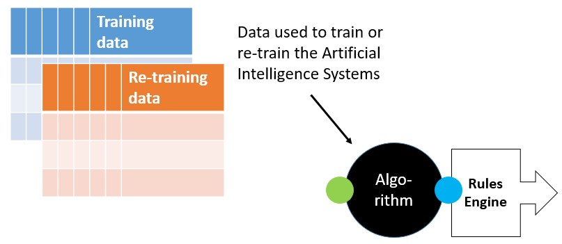
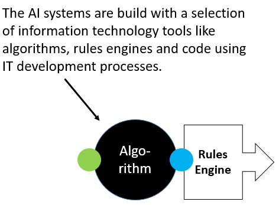
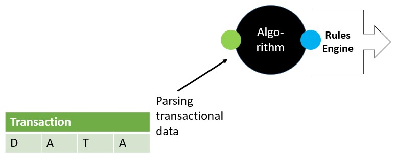
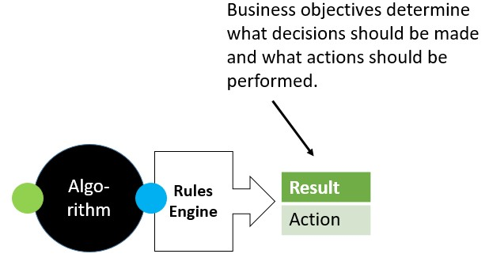
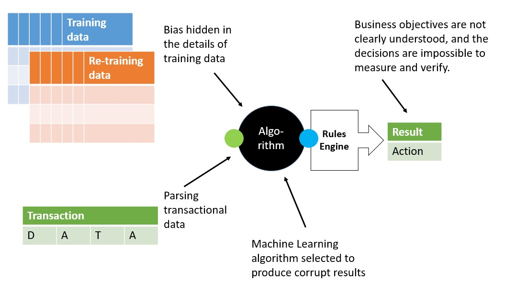

# Introdution

Artificial Intelligence (AI) is unconscious and has no will or desires. AI does not decide or act *by itself*. Like all tedhnologies it is a collection of inactive code and/or materials - dead on arrival.

We - humans - bring technology to life. We decide what it should do. We develop and deploy it and we use the technology for our purpose and to our benefit. Even autonomous machines built with artificial intelligence like cars, drones or medical devices works to serve a purpose, we, not them, have decided.

AI ranges between the most powerful technologies like nuclear power, smart phones or the internet. AI is powerful due to its versatility, general usefulness, scalability and because of that it's cost-effectiveness.

AI is already in our daily lives. The capabilities and proliferation grows fast. All the conditions for the "big AI bang", we are in the midst of, are there: algorithms, tools, IT infrastructure and vast data volumes.

Like all powerful technologies, AI can be used for good or be harmful. The results depends on the intentions of the people with the power of controlling AI. 

'The time has come: AI technology needs to be controlled and misuse prevented.

Transparency International focus on exploitation of power for unfair advantages and transparency for the people, who might be exploited.

We do not judge how technology is used for legitimate pursuits of political or business objectives, e.g. build profits, lower costs or mitigate risks. As long as technology is applied in a fair and transparent way, we have no opinion about it, other than a general support of building a fair, transparent, just and sustainable world with equal opportunities for all human beings.

We hold power to account, also AI based power. We are concerned if AI creates or scales risk of corruption.  Our definition of AI corruption is:

***Abuse of AI systems by entrusted power holders for their private gain.***

Transparency International are not the only one with these concerns. Legislation and regulation is partly there or underway in several jurisdictions. The AI industry forms policy groups or associations promoting best practice and voluntarily refrainment of the worst misuse. But legislation is slow and complex and free market forces has so far failed to provide the level playing field we need.

Like for nuclear power, dangerous chemicals or military weapons we believe and support the emergence of acknowledged, effective and transparent rules for the benefit and safety of us all.

## Recommendations

For practitioners at this time, Transparency International recommends:

- Understand *who is entrusted with power* to control or influence how AI works, and the *private gains* these powerful people can obtain
- make a *risk assessment* through the lifecycle and supply chain of AI systems
- implement *risk mitigation* based on distribution of power and check and balances
- *comply* with current legislation and regulation for the relevant jurisdictions

# Data Ethics and Artificial Intelligence

Automated systems, that take decisions by themselves, are already everywhere around us.

Complex machines like cars, planes, manufacturing and medical equipment, all use chips with embedded logic, algorithms and artificial intelligence  to operate. Security systems in private and public places scans video streams to find anomalies and signs of trouble. Even lawn moves, refrigerators and air conditioning can operate on their own.

Office administration are more and more becoming digital. Also creative jobs are impacted. Everything that involves processing data and recognizing patterns can take advantage of information technology.

Our minds and thoughts are influenced by messages, social media and news feeds. We are exposed to the endless stream of information. Much of this is sorted, directed and even generated by algorithms and artificial intelligence.

As a society we need to benefit from the enormous potential while not being naïve optimists. Like all powerful new technologies, algorithms combined with big data must be controlled. We need to realize, that when decision power moves from man to machines, misuse moves as well.

Unethical use of data and misuse of algorithms for private gain are corruption. It is already happening. We need to take control now and are already late.

## Data Ethics

When data is being used for machine learning or artificial intelligence systems, there are data protection regulations and legal requirements to adhere to. Sensitive personal data are protected, at least in some jurisdictions around the world. Rules determine what *can* or *must not* be done with the data.

------

- Examples of data protection regulations
  - [General Data Protection Regulation (GDPR)](https://en.wikipedia.org/wiki/General_Data_Protection_Regulation) of the European Union
  - [American Data Privacy and Protection Act](https://crsreports.congress.gov/product/pdf/LSB/LSB10776) if the United States of America
  - [Data Security Law](http://www.npc.gov.cn/englishnpc/c23934/202112/1abd8829788946ecab270e469b13c39c.shtml) of the People's Republic of China

Even if a certain use of data is legal and within the regulations, it may still not be considered an ethical use. Ethics is the art of *should* or *should not* do.

But what is '[ethical](https://en.wikipedia.org/wiki/Ethics_of_artificial_intelligence)' in relation to 'artificial intelligence' and use of data? The issue is that there are no authoritative, generally agreed definition of, what is ethical or un-ethical. There are no fixed measures or tests that validate if a certain use of data as ethical or not. It depends on human perception, decency and morality. It involves a level of self control and to behave even with someone is not looking.

In general, most cases building on consent from the data owner or subject is considered in the ethical realm. 

------

- Example: Scanning electronic patient records (EPR) to determine if the right claims were made for insurance re-imbursement is considered ethical.

If data is used in an ethically acceptable way, almost by definition, it is also not used in a corruptive way.

## Un-ethical data use

Identifying a certain use of data as 'un-ethical' is just as difficult. There are at least three variants of un-ethical data usage.

### Un-intended

Data may be used without intention in a way, where the effect is not ethical.

This may caused by genuine errors, sloppy IT development and quality assurance, or imprecise requirements.

------

- Example: Job application are filtered for the first interview, but no women are selected even when they qualify against the job requirements. The reason was poor quality of training data.

### Intended

Data may be intentionally used in un-ethical ways by somebody, who sees a benefit of doing so.

Use of data in spite of expressed user consent or accepted terms and conditions without informing the impacted persons is generally not considered ethical.

------

- Example: Customers are profiled for price hikes to secure profits by exploiting information about customer relation.
- Example: Racial discrimination in predictive crime algorithms that aligns with prejudice of the police force or general population. 

### Misuse for private gain

When decision power is transferred from humans to systems, there is a motivation to also corrupt the machines and AI algorithms now in charge.

Machines may be corrupted by intention to deliver unfair advantage or profits to those with power for their private gain. Even if un-ethical use of data is not by default corrupt, *intended misuse for private gain* is.

Examples are listed in the following.

# Artificial Intelligence corruption

Transparency International define AI corruption as:

***Abuse of AI systems by (entrusted) power holders for their private gain.***

Humans has shown again and again that they can and will corrupt each other. We now see, that humans also can and will corrupt systems and algorithms for private gain.

Corruption involves two elements: Someone is misusing a power entrusted with them, and someone obtains a private gain by doing so.

## Entrusted power

Artificial intelligence systems don't get born and move through life like human beings. Employers, users or even legislators have entrusted certain people with the power to create, control, operate or use these systems.

People can be entrusted with power over AI systems in several places. The power is entrusted with them as part of their job responsibilities or by engaging as a third party.

### Access to data for training AI systems

Training data is one of the key success criteria of preparing AI algorithms. 

For using data ethically they need to be unbiased and represent a fair, truthful view of the problem, that the AI system should deal with.

A person with power to decide or influence what goes into the training data, or the mark-up of data content can ultimately tweak the AI algorithm in unfair, un-ethical ways.

### Access to development of AI systems

Most systems have the AI algorithms making suggestions or predictions based on statistical weighting that are not absolutely YES or NO. These results then have to be acted upon by follow-on IT systems, that make interpret the statistical weight and make the recommendation or take the decision and act accordingly.

Changing the rules that interpret the AI algorithm output and trigger recommendations or actions.

------

- Example: The AI algorithm calculates, that a particular job application should be selected for interview by a 0.96 score. The following IT system has a rule, that says all applications scoring above 0.95 should go to the interview list.

These rules can be influenced, so the end-to-end system bay produce unfair, un-ethical results.

This risk has more to do with the integrity of the IT development processes then with AI algorithms in particular. These processes are normally well understood and protected.

However, newer methods like continuous development, integration and deployment (e.g. DevOps or DataOps) present new challenges of control and securing audit trails.

### Access to data being prepared for processing by AI systems

An AI system is moved into operational use after being developed.

Data, that is presented to the AI algorithm now needs to be prepared. This preparation step, often called 'parsing' can be tweaked so the AI system delivers unfair and un-ethical results.

------

- Example: Job applications in PDF, handwritten, email or schema formats need to pre-processed to one structured data scheme before sent to the AI algorithm. False data can be introduced at this point to have a particular application selected or omitted for next stage interviews.

- Example: Image data may be tweaked or have mask overlays that influence the AI algorithm to come to a different result when analysing the image. This has been done with Xray scans of patients being investigated for possible cancer.

### Management power

The managed has the power to decide which processes should be moved to AI systems and what the success criteria are. If these decisions are not precise and present no measurable objectives that can be verified against, then it is harder to know for the defvelopers when the AI system has the nessecary quality for going into operation.

------

- Example: The management decides to move the selection of job applications to an AI system. It should "select the best candidates for the job, and we should save HR time for this screening process". This gives system developers the power to decide, which job applicants to select, and opens the risk of introducing for example racial or gender bias, which is not detected because it is not tested for.

## Private gain

Humans gain from corrupting systems by obtaining illigal or un-ethical favors or money.

### Services or money

Services like promotions or sexual, or money like cash can be hoth the reward or the offering used to have people with entrusted powers like above make unfair or un-ethical changes to the systems.

Services or money are classic, old fashioned instruments to corruptions like bribery, embezzlement or blackmail.

------

- Example: I give you this money, and you tweak my picture of my car accident so my insurance claim is not selected for further inspection but are automatically paid out.
- Example: Your technical capabilities will be promoted massively on our social media channels, if you build in hidden pro-life bias in your company's recommendation engine for medical treatments.

### Promotion of interests

The reward for twaaking AI systems in unfair and un-ethical ways can be the promotion of special interests. This could be a political agenda like white supremacy or favors to your family or friends.

------

- Example: I give you this money, and you make this AI system select white, Christian white males for job interviews.

- Example: I offer this job to your son if you insert this data into the training of the AI algorithm you have access to.

# AI risks

[Corruption](https://www.transparency.org/en/what-is-corruption) has many shapes and has existed since humans began to organize more complex communities. Humans has always corrupted other humans for private gain.

The proliferation of AI systems everywhere in our systems and processes opens a whole new field of corruption risks. AI systems are vulnerable and can be misused for private gain. There are at least the following reasons why AI systems increase the risks to a completely different level.

## Scale

When a process is moved from humans to machines, then the intelligence of that system influences far more than any one human being can do.

------

- Example: A job application selection AI system are used to process all job applications for the whole company to get effeciency gains. This was done by 10 persons in HR previously. Corrupting one AI system now influences all job applictions, where corrupting one HR person before only influences one tenth.

"If you bribe a person, perhaps 10 other persons may be unfairly impacted. If you bribe a system, perhaps 10.000 people are impacted."

## Opaque

It is not possible to see, what goes in inside the black box of the AI algorithms and how they arrive to a result. Probabilistic code cannot be read out and understood like deterministic programming code.

The training data can be massive and impossible to interpret. When production transactions with data, which are new to the AI algorithm, are fed into the system, it is not possible to determine why *this* result was caused by *that* training data.

This opacity also make it hard to detect if un-ethical corruption is happening. If you cannot explain why *this* transaction caused *that* result, you cannot determine if the result is un-ethical or corrupt.

------

- Example: A medical AI system investigates a condition and prescribes a medicine for treatment. A corrupt bias has secretly been build into the system so the product of a certain manufacturer is prescribed 10% more, than it otherwise would have been. This represent a huge unfair profit for the manufacturer, but also that the patient may not always get the most effective treatment.

## Loss of knowledge

When a process is moved to an AI system, knowledge goes with it. Users will over time tend to rely on the system and become less critical of it's decisions.

The risk is, that the human users over time loose the expert knowledge to see if the AI decisions are fair and ethical and just let it pass.

The professionalism disappears or reduces, and expert or common sense validation of the system during daily use does not happen.

------

- Example: The HR person is under time pressure to be efficient in the job and will not reflect on the job application selections by the AI system, but just pass them on.

Also, once the system is going, then new hires may not have to qualify on the same knowledge level as the previous employees, and over time the collective pool of knowledge will diminish.

Loss of knowledge can also impact whistleblowing. If the systems are becoming so opaque and complex, that humans don't really understand if the decisions are OK or not, then it will be much harder to raise and investigate whistleblower reports.

## Concentration of power

Power will concentrate to people with influence on AI training, IT development or access to data during operation, and move away from people in the business units, and specially the people impacted by the automated decisions.

# Challenges

There are several challenges to overcome before the risks above can be addressed.

Some are inherent in the underlying technology components of AI systems, others come from the way business is organized or the way key concepts are understood.

## Lack of consensus

There are no consensus of *fair* or *ethical*. The understanding of these concepts vary according to culture, country, organization or even between any two people.

It is very difficult to determine for certain that an AI system is behaving fair and ethical because there are no universal, measurable measures for *fairness* or *ethical*.

## Undisclosed business objects

The objective, that the AI system is designed to achieve may not be disclosed to the public. A number of organizations regard the objectives of the technology they deploy to be business confidential, and if exposed to reveal trade secrets.

------

- Example: Meta's business model relies on traffic on Facebook and Instagram, driving advertisement revenue. The search and selection algorithms are designed to grow traffic. The way to do that may be to prioritize news and posts that has emotional impact over objective truths. But the precise objective is not known outside Meta, we can only speculate if the algorithms support Meta's business objectives, or the common good for all humankind.
- Example: The objective of chatbots, that are deployed on a company's support pages may be to offer self-help service advice, but may also have an element of promoting the next generation product or add-on's for additional sales. This  is objective not disclosed outside the company. The result may be unfair bias in the advice presented to the user.

### Protected Data

Data used to train AI systems may be protected, and rightly so. It may contain very sensitive personal data.

------

- Example: Health care systems that are fed with patient data and results in a diagnose diabetes and recommend a correct dose of insulin need to be trained with large volumes of historical patient records, insulin usage and treatment outcomes. This is very sensitive personal information and protected by a number of data privacy regulations. It is not possible for the system developers to disclose in detail all the training data they used in the development and quality assurance process. This is also true for the transaction data, that are later fed to the system and the recommendations made. 
- Example: Military machines like self-guided missiles are often using reinforcement algorithms, that are trained in a high number of real or simulated situations. These situations are confidential to the military and cannot be exposed in public. Wars are not fought and won in highly ethical ways, but these weapons may be used for other purposes as well.
- Example: A company uses data about its customers that are GDPR protected and cannot be shared outside the company, and thus makes it impossible for any outside third party to validate that the company's AI engine is trained in fair and ethical ways.

### Algorithms

The AI algorithms may be intellectual property as well. The algorithms are mathematical formulas or models as well as software components.

The algorithms and the tools to train and configure them are often sold as services, where clients are using them from an external interface. How they are build and how they work in detail is hidden - the algorithms are as much a black box as the AI system themselves!

------

- Examples: Amazon Web Service offers [ AI Services ](https://aws.amazon.com/machine-learning/ai-services/). Google offers [ Google AI ](https://ai.google/). Microoft offers [ Microsoft AI ](https://www.microsoft.com/en-us/ai/). These are all commercial products, which are sold on the market and generates revenue. Their design, effiency and accuracy are also a competitive factor on the market. New developments can provide the vendor with a market advantage in a certain time span. The algorithm features are  trade secrets, and the companies will not expose their intellectual properties.

## Missing legal context

There are no laws or regulations for AI usage in most juristictions around the world.  If laws exist, the enforcement is mostly weak and inadequate.  Companies and people are allowed to use AI technology in any way, they choose.

The **data** are often protected by regulations like EU/GDPR.

The **AI Technology** is not.

Legal frameworks has been defined and are offered, but they are not transposed info in law and therefore not enforced.

One of the strongest coming is from the European Union, preparing a comprehensive AI regulation., the [AI Act](https://www.europarl.europa.eu/news/en/headlines/society/20230601STO93804/eu-ai-act-first-regulation-on-artificial-intelligence)  As of July 2023, this is still in the final works, and once approved still have to be embedded in the EU countries legislation.

And then there is the world outside EU, in particular USA and China - big users of the AI technology and mostly unregulated.

------

- Example: In China, facial recognition is widespread, and CCTV systems are used to identify and monitor individuals for both criminal and political investigations. Broad use of facial recognition in public spaces is proposed in the *EU AI Act* to be forbidden.

## Corruption

The perception of misuse of AI systems are not clearly defined, and there are no wide consensus. This make it hard to detect attempts of misuse, and then to prevent it.

------

- Example: Transparency International defines it as *AI misuse of entrusted power for private gain*. Other oranizations or individual companies may have a different definition.

## Ease of use

The AI technology and the tools to develop and deploy AI applications are already today easy to use. They constantly improve both in features and supporting tools.

The cost of development and operation is coming down. More and more IT people and team are enabled to work with AI technology.

The consequence of this is, that we will see more and more AI applications for more and more purposes. 

# Transparency International

TI has a growing focus on data protection and technology, and the dangers that corruption behaviour jumps from the human to the machine world.

TI's position is

- Algorithmic **transparency** - factors that influence a decision must be defined and visible to the peope affected.
- Algorithmic **accountability** - those who employ the algorithm must be accountable for the outcome.
- Algorithmic **auditability** - Access to ML systems and data must be available to independent auditors.
- This must be **enforced** by regulation and judicial systems.

Free media, independent legal systems, regulation with audits and general awareness are needed also for managing the risks of digitalization.

# Recommendations

For practitioners at this time, Transparency International recommends:

- Understand *who is entrusted with power* to control or influence how AI works, and the *private gains* these powerful people can obtain
- make a *risk assessment* through the lifecycle and supply chain of AI systems
- implement *risk mitigation* based on distribution of power and check and balances
- *comply* with current legislation and regulation for the relevant jurisdictions

## Entrusted power

[ to be developed ]

## Risk assessments

Before any misuse can be controlled and prevented, we recommend clarity of what to look for, and where.

We propose, that organizations and enterprises that deploy algorithm based systems perform a risk assessment, focussing on intended as well as un-intended misuse.

It is already good practice to check for in-intended properties of artificial intelligence systems like hidden biases, or poor results compared with the objectives. What need to be added to the risk assessments is the *intended* misuse for private gain.

The development, deployment and operational processes of automated systems need to be assessed for loopholes or gaps in control and audit.

------

- Selection, integration and mark-up of data used to train algorithms. Assessment of risk of hidden biases or manipulation, e.g. discrimination or blind spots.
- Capturing, rendering, reformatting and integration of operational data to be processed by artificial intelligence systems, e.g. job applications or scanning pictures.
- Rules engines that transact the algorithm results, 

Risk assessment can be extended with good procedures for for investigating and prevention of intended misuse like functional separation of development and quality assurance of systems in development, and securing audit trails from AI systems in operation with enhanced controls of the business processes using the systems.

## Risk mitigation

[ to be developed ]

## Regulation

Transparency supports legislation and regulation for digitalization of machines and processes, and the use of data and algorithms.

------

- We trace the EU AI Act and look forward to the finalizing the Act and the following transposition into EU countries.

# References

[Algorithms in public administration](https://www.transparency.org/en/blog/algorithms-artificial-intelligence-public-administration-transparency-accountability): How do we ensure they serve the common good, not abuses of power? 
Transparency International, October 2021

[Bribes for bias](https://www.transparency.org/en/blog/bribes-for-bias-can-ai-be-corrupted): Can AI be corrupted?
Transparency International, February 2023

###### Lars Wriedt, July 2023
